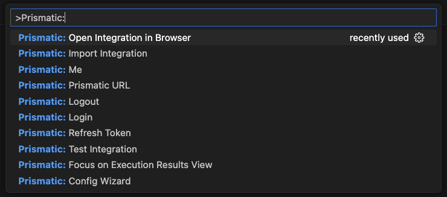
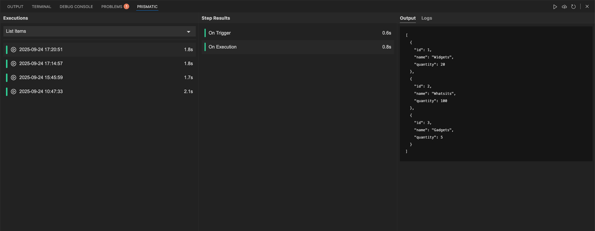
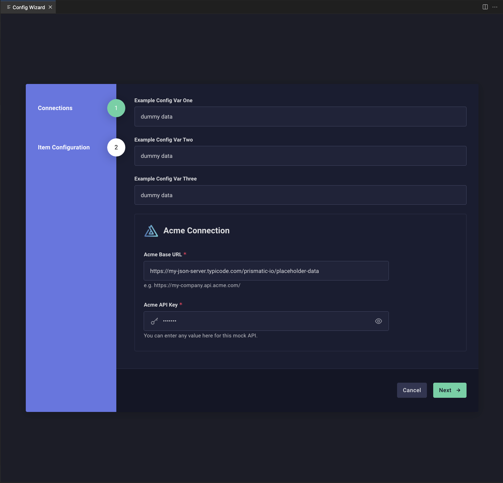

# Prismatic Extension for VSCode & Cursor

An extension for VSCode & Cursor that improves the developer experience around Code-Native Integrations (CNI) by enabling test execution, integration imports, instance configuration, and inspection of execution results directly within the IDE.

## Purpose

The main intent of this extension is to offer:

1. **Seamless Development Workflow Integration:**
   This extension bridges the gap between local development and the Prismatic platform by providing direct access to integration testing, configuration, and debugging tools within your IDE. Instead of constantly switching between your code editor and the Prismatic web interface, developers can manage their entire CNI development lifecycle from VS Code, reducing context switching and improving productivity.

2. **Real-time Testing and Debugging:**
   The extension provides immediate feedback on integration performance through real-time test execution and detailed step-by-step output streaming. This allows developers to quickly identify issues, debug problems, and iterate on their integrations without leaving their development environment, significantly reducing the feedback loop between coding and testing.

3. **Unified Configuration Management:**
   By integrating the Prismatic CLI directly into VS Code, the extension ensures consistent configuration management across different environments and team members. The Config Wizard provides a guided interface for setting up integration instances, while maintaining synchronization with the Prismatic platform, ensuring that local development configurations stay aligned with production environments.

## Features

- **Authentication**: Secure login and token management via built-in OAuth 2.0 PKCE flow with multi-tenant support.
- **Config Wizard**: Configure integration instances with a guided interface.
- **Execution Results**: View detailed step-by-step outputs and logs.
- **Integration Import**: Direct import of integrations from Prismatic via the Prism CLI.
- **Status Bar**: Displays the current organization and active integration at a glance.
- **Integrations Sidebar**: Tree view listing all Code-Native Integrations in your workspace.
- **Integration Details**: Sidebar panel showing configuration state, flows, and connections with inline OAuth.
- **Flow Payloads**: Hierarchical tree view of flows and their test payload files.
- **State Management**: Persistent state across extension sessions.
- **VSCode Theming**: Seamless integration with VS Code's theme system.

## Prerequisites

- A [Prismatic account](https://prismatic.io).
- VSCode [version 1.96.0 or higher](https://code.visualstudio.com/updates/v1_96) or [Cursor](https://www.cursor.com/).
- A [Prismatic Code-Native Integration (CNI) project](https://prismatic.io/docs/integrations/code-native/).
- The Prismatic CLI ([Prism](https://prismatic.io/docs/cli/#installing-the-cli-tool)) installed globally — required for the **Import Integration** command.

## Usage

The extension provides commands and webview panels that can be accessed through the VS Code command palette:

1. Press `Cmd+Shift+P` (Mac) or `Ctrl+Shift+P` (Windows/Linux)
2. Type "Prismatic" to see available commands.

### Available Commands

#### `Prismatic: Config Wizard`
Launches the Config Wizard to edit configuration values for your integration instance.

#### `Prismatic: Import Integration`
Imports the Code-Native Integration (CNI) from your local project into the Prismatic platform.

#### `Prismatic: Test Integration`
Executes a test for the Code-Native Integration (CNI). After the test is complete, it streams step outputs and logs for debugging.

#### `Prismatic: Create Flow Payload`
Generates a sample flow payload for testing purposes. This can be used to simulate real-world data inputs during integration testing.

#### `Prismatic: Login`
Opens your browser to authenticate with Prismatic via OAuth. After authenticating, the extension stores your session securely in VS Code's secret store. If your account has access to multiple tenants, you'll be prompted to select one.

#### `Prismatic: Logout`
Clears your stored authentication session.

#### `Prismatic: Switch Tenant`
Switch between Prismatic organizations or tenants without logging out and back in. Displays a quick pick with all available tenants.

#### `Prismatic: Prismatic URL`
Sets the Prismatic instance URL used by the extension. This allows you to change your Prismatic stack environment. Changing the URL triggers a re-authentication against the new instance.

#### `Prismatic: Select Integration`
Switch the active integration. Displays a quick pick listing all Code-Native Integrations found in your workspace.

#### `Prismatic: Open Integration in Browser`
Opens the Code-Native Integration (CNI) in the browser. This is useful for debugging and inspecting the integration from the Prismatic application.

#### `Prismatic: Reveal in Explorer`
Reveals the active integration's directory in the VS Code file explorer.

#### `Prismatic: Me`
Displays details about the currently authenticated Prismatic user, including name, email, organization, and Prismatic stack endpoint URL.

#### `Prismatic: Refresh Token`
Refreshes your Prismatic authentication token to ensure continued access without needing to log out and back in. The extension also refreshes tokens automatically before they expire.

#### `Prismatic: Focus on Execution Results View`
Displays the results of the Code-Native Integration (CNI) test. This includes the executions, step results (onTrigger and onExecution), and step outputs & logs.

### Available Webviews

#### `Prismatic: Focus on Execution Results View`
Displays the results of the Code-Native Integration (CNI) test. This includes the executions, step results (onTrigger and onExecution), and step outputs & logs.

#### `Prismatic: Config Wizard`
Displays the Config Wizard to edit configuration values for your integration instance.

## Extension Settings

Configure the extension through VS Code's settings (`Cmd+,` on Mac or `Ctrl+,` on Windows/Linux) and search for "Prismatic".

### `prismatic.prismCliPath`

Path to the Prism CLI executable. If not specified, the extension searches for `prism` in your system PATH, falling back to npx. Only required for the **Import Integration** command.

Examples:
- `/usr/local/bin/prism`
- `/opt/homebrew/bin/prism`
- `${userHome}/.npm-global/bin/prism`

### `prismatic.npmCliPath`

Path to the npm executable. If not specified, the extension searches for `npm` in your PATH and common installation locations (Homebrew, nvm, asdf, etc.).

Examples:
- `/usr/local/bin/npm`
- `/opt/homebrew/bin/npm`
- `${userHome}/.npm-global/bin/npm`

### `prismatic.debugMode`

Debug logging level for command execution. Useful for troubleshooting CLI or environment issues.

| Value | Description |
|-------|-------------|
| `off` | No debug logging (default) |
| `basic` | Logs command, working directory, and Node version |
| `verbose` | Logs command, working directory, Node version, and all environment variables |

Debug output appears in the Prismatic output channel (View → Output → select "Prismatic" from dropdown).

## Troubleshooting

If you encounter issues:

1. Enable debug mode by setting `prismatic.debugMode` to `basic` or `verbose` in your VS Code settings
2. Check the Prismatic output channel (View → Output → "Prismatic") for detailed logs
3. If **Import Integration** fails, ensure the Prism CLI is installed globally (`npm install -g @prismatic-io/prism`) and verify with `prism --version`
4. If authentication fails, check that your Prismatic URL is set correctly via the **Prismatic: Prismatic URL** command
5. Try reinstalling the extension

## What is Prismatic?

Prismatic is the leading embedded iPaaS, enabling B2B SaaS teams to ship product integrations faster and with less dev time. The only embedded iPaaS that empowers both developers and non-developers with tools for the complete integration lifecycle, Prismatic includes low-code and code-native building options, deployment and management tooling, and self-serve customer tools.

Prismatic's unparalleled versatility lets teams deliver any integration from simple to complex in one powerful platform. SaaS companies worldwide, from startups to Fortune 500s, trust Prismatic to help connect their products to the other products their customers use.

With Prismatic, you can:

- Build [integrations](https://prismatic.io/docs/integrations/) using our [intuitive low-code designer](https://prismatic.io/docs/integrations/low-code-integration-designer/) or [code-native](https://prismatic.io/docs/integrations/code-native/) approach in your preferred IDE
- Leverage pre-built [connectors](https://prismatic.io/docs/components/) for common integration tasks, or develop custom connectors using our TypeScript SDK
- Embed a native [integration marketplace](https://prismatic.io/docs/embed/) in your product for customer self-service
- Configure and deploy customer-specific integration instances with powerful configuration tools
- Support customers efficiently with comprehensive [logging, monitoring, and alerting](https://prismatic.io/docs/monitor-instances/)
- Run integrations in a secure, scalable infrastructure designed for B2B SaaS
- Customize the platform to fit your product, industry, and development workflows

## Who uses Prismatic?

Prismatic is built for B2B software companies that need to provide integrations to their customers. Whether you're a growing SaaS startup or an established enterprise, Prismatic's platform scales with your integration needs.

Our platform is particularly powerful for teams serving specialized vertical markets. We provide the flexibility and tools to build exactly the integrations your customers need, regardless of the systems you're connecting to or how unique your integration requirements may be.

## What kind of integrations can you build using Prismatic?

Prismatic supports integrations of any complexity - from simple data syncs to sophisticated, industry-specific solutions. Teams use it to build integrations between any type of system, whether modern SaaS or legacy with standard or custom protocols. Here are some example use cases:

- Connect your product with customers' ERPs, CRMs, and other business systems
- Process data from multiple sources with customer-specific transformation requirements
- Automate workflows with customizable triggers, actions, and schedules
- Handle complex authentication flows and data mapping scenarios

For information on the Prismatic platform, check out our [website](https://prismatic.io/) and [docs](https://prismatic.io/docs/).

## License

This project is licensed under the MIT License - see the [LICENSE](LICENSE) file for details.
